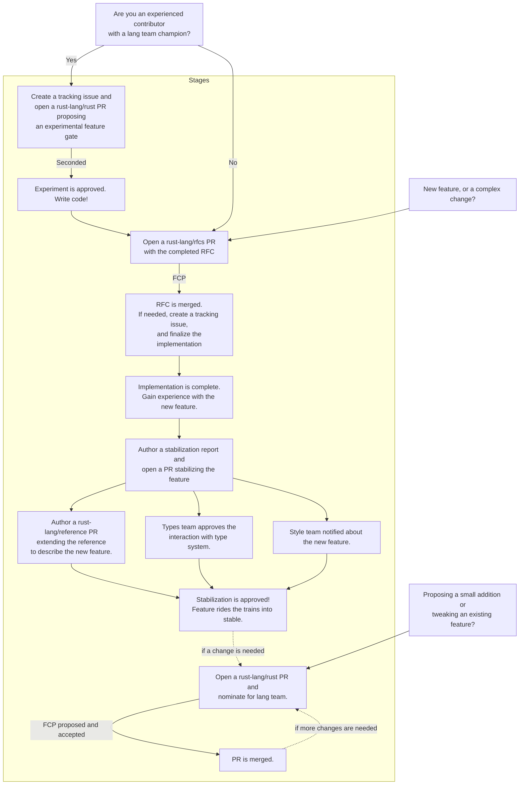

# Proposing a change to the language

Do you have an idea for a new language feature? The following page describes the lang team policy around changes to the language.

## TL;DR

The highlights are these:

* An [RFC] is required for most changes.
* Small changes that fit in a PR, have narrow impact, and are uncontroversial can skip the RFC process ([read more](#what-constitutes-a-small-addition-or-tweak-to-an-existing-feature)).
* If you have a lang-team champion and an experienced implementor, you can start [experimenting](./experiment.md) by just adding a feature gate and a tracking issue, but you'll still need an RFC later.

[RFC]: https://github.com/rust-lang/rfcs/#when-you-need-to-follow-this-process

## Complete flowchart

The following lays out the complete flow chart for language features. Note that you can click on most of the nodes to read about that step in more detail.

## Frequently asked questions

### What do the labels "lang-team second" and "lang-team consensus" mean?

These refer to our [decision process](./decision_process.md):

* A **second** means that some [lang team member] must champion the idea, but it doesn't require full checkboxes. Instead, the idea goes immediately into "final comment period" (which lasts for 10 days), giving other lang team members a chance to comment on it and raise concerns. We use seconding for *reversible decisions* that don't commit the language to anything in particular.
* A **consensus** means that every [lang team member] must check their box and actively approve.

In both cases, we currently handle consensus with rfcbot (`@rfcbot fcp`). For a second, however, the lang team member who initiatives FCP can go ahead and check the boxes of other lang-team members, they can raise concerns if needed. This is a temporary measure until we have first-class support for FCP.

[lang team member]: https://www.rust-lang.org/governance/teams/lang

### Are RFCs required for every language change?

No! For small additions or tweaks to existing features, you can simply implement the change, open a PR, and [nominate] it for lang-team attention. If the change turns out to be complex or controversial, though, we may close the PR and request an RFC instead.

[nominate]: ./nominate.md

### What constitutes a "small addition or tweak to an existing feature"?

We do not require an RFC for everything. Small changes that fit in a single PR, have narrow impact, and are uncontroversial can skip the RFC process. Simply make the change, open the PR, and [nominate] it for lang-team feedback. But be aware that we may still ask you to write an RFC! The rule of thumb is that we use RFCs for ideas that impact a lot of users or are potentially controversial. They're a great way to get broad feedback from the community about an idea.

**If you choose to open a PR without an RFC, please document the motivation and details of your change!** Very often people will open a PR that changes some code in the compiler without clearly explaining what they are trying to achieve. Also, please make the explanation "self sufficient" -- avoid linking to internals threads or other places where we have to read a bunch of context to understand what is going on (it's encouraged, however, to provide a summary and link to threads for more details).

Some examples where RFCs are typically NOT required...

* Narrow changes like adding support for a new ABI (this may even just be a compiler concern).
* Soundness fixes to existing features, unless they have large impact or change the way people have to write Rust, in which case we may opt for an RFC.
* Small changes to complex rules, such as name resolution, intended to address a particular problem and which don't impact most users; often in cases like these RFCs do not provide valuable feedback, and so we'll instead focus on getting the relevant experts to weigh in. **This category in particular still needs to have a detailed write-up.**
* Extending a lint to cover more instances of the same general pattern, or to be more precise.
* Proposing a new lint that is narrow in scope.

### What is the policy for adding a new lint?

We have a streamlined process for most lint proposals. See the [How do I add a new lint?](./new_lint.md) for details.

### Do experiments *always* require an RFC?

In the diagram above, we show experiments as always leading to an RFC. This is typically the case because experiments tend to be for larger, more ambitious features. However, if the experiment turns out to be a relatively small change to the language -- i.e., some change that would not require an RFC anyway -- then you can skip the RFC and move straight to stabilization.

### What about adding special traits and things to the standard library?

We consider intrinsics and "lang item" (things that need special treatment from the language) to be under the lang team purview. Specifically, the lang team governs the semantics and capabilities exposed by this new feature. The details of the API are governed by the [libs team].

Whenever possible, though, we prefer to issue a quick approval for the "general feature" being discussed, and leave it to the libs team to decide where to apply it. For example, we approved the ability to add inherent methods to standard library types like `u32` long ago, but the [libs team] governs what APIs are available.

[libs team]: (https://github.com/rust-lang/libs-team)

### My RFC has been waiting for a comment from the lang-team for a long time!

First off, I'm sorry, that sucks. We are aware that we need to do a better job keeping up with RFCs. :/ That said, what you can do is to [nominate](./nominate.md) the RFC and we will discuss it during the meeting.
