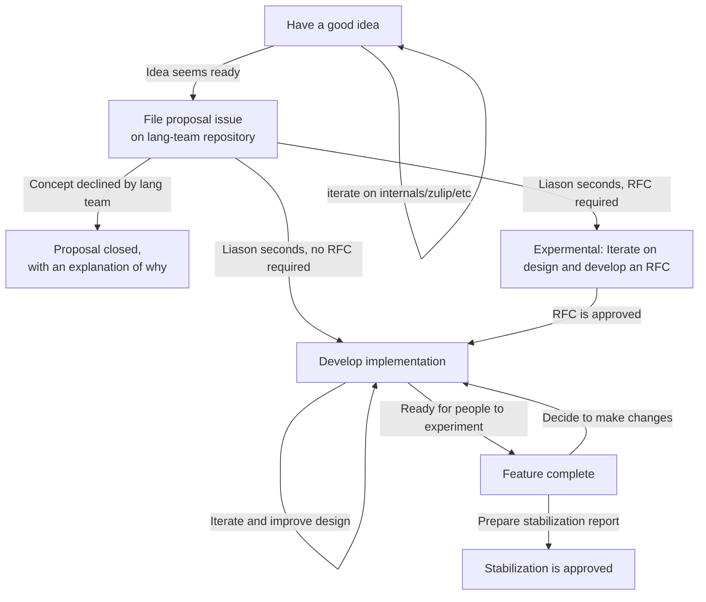

# Stages of an initiative

Presuming that an initiative continues successfully, it will go through the following stages:

| Phase                                 | Goal                                      | Permits                                                                                       | Successful exit                                           |
| ------------------------------------- | ----------------------------------------- | --------------------------------------------------------------------------------------------- | --------------------------------------------------------- |
| [Proposal]                            | Find a team [liaison]                     | Discussion                                                                                    | Team member seconds, thereby agreeing to act as [liaison] |
| [Experimental] (sometimes skipped) | Refine the design and work towards an RFC | Active zulip stream; tracking issue / repository; code can land under "unstable" feature gate | RFC is approved by team                                   |
| [Development]                         | Finalize design and implementation        | Removing the "experimental" tag on a feature                                                  | Liaison declares the proposal feature complete            |
| [Feature complete]                    | Gathering feedback                        | Advertisting the initiative as "feature complete"                                             | Stabilization proposal approved                           |
| [Stabilized]                          |                                           | Use on stable branch                                                                          | (none)                                                    |

The "experimental" stage can be skipped if the initiative is sufficiently simple that a RFC doesn't seem necessary; see ["simple initiatives"](#simple-initiatives) below.

Initiatives can also become [inactive] for a variety of reasons.

[proposal]: ./stages/proposal.md
[experimental]: ./stages/experimental.md
[development]: ./stages/development.md
[feature complete]: ./stages/feature_complete.md
[stabilized]: ./stages/stabilized.md
[inactive]: ./stages/inactive.md
[liaison]: ./roles/liaison.md

## Simple initiatives

The above process is the ideal, but there are alternative routes that occur in practice for simple initiatives. The most common is one that begins with a PR:

- Implement the idea and open a PR.
- [Nominate](../../how_to/nominate.md) the PR to the lang team's attention.
- The lang team may opt to either approve the PR (skip directly to "feature complete"), assign an owner (skip directly to "development"), or to request a proposal.

## Umbrella initiatives

Some initiatives are broader in scope and are tagged as "umbrella initiatives". These are far-reaching tasks like "async I/O". While they have goals, they don't have a clear stage. Instead, they have project boards (and potentially subinitiatives) of their own that track their state.

## Diagram

